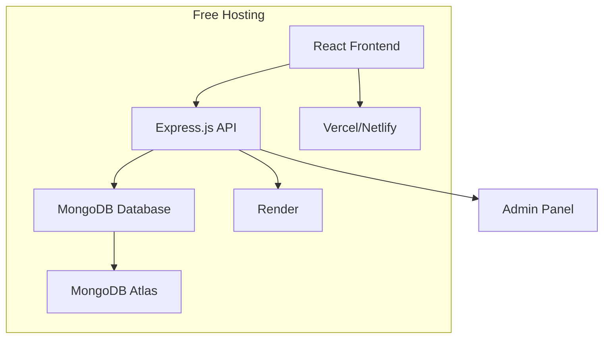

# Design Document

## Overview

SchoolScoop is a lightweight, anonymous school-based forum application designed for free hosting deployment. The system uses a simple three-tier architecture with a React frontend, Node.js/Express backend, and MongoDB database, all optimized for free-tier hosting services like Render, Vercel, and MongoDB Atlas.

## Architecture

### System Architecture


### Technology Stack
- **Frontend**: React.js with responsive CSS (mobile-first design)
- **Backend**: Node.js with Express.js framework
- **Database**: MongoDB with Mongoose ODM
- **Hosting**: 
  - Frontend: Vercel or Netlify (free tier)
  - Backend: Render (free tier)
  - Database: MongoDB Atlas (free tier - 512MB)

## Components and Interfaces

### Frontend Components

#### 1. Home Component (`/`)
- **Purpose**: Display school list and create school option
- **State**: `schools[]`, `loading`, `error`
- **Actions**: Navigate to school, open create school modal

#### 2. SchoolPage Component (`/school/:schoolId`)
- **Purpose**: Display class filter and rumors feed
- **State**: `selectedClass`, `rumors[]`, `loading`
- **Actions**: Filter by class, navigate to create rumor

#### 3. CreateSchool Component (Modal)
- **Purpose**: Form for requesting new school creation
- **Fields**: `schoolName`, `city`
- **Validation**: Required fields, character limits

#### 4. CreateRumor Component (`/school/:schoolId/create`)
- **Purpose**: Anonymous rumor/confession creation form
- **Fields**: `class`, `content` (300 char limit)
- **Actions**: Submit anonymously, return to feed

#### 5. AdminPanel Component (`/admin`)
- **Purpose**: Manage pending school requests
- **Authentication**: Hardcoded username/password
- **Actions**: Approve/reject schools, view all schools

### Backend API Endpoints

#### School Management
```
GET /api/schools - Get all approved schools
POST /api/schools - Create school request (pending approval)
GET /api/admin/schools/pending - Get pending school requests
PUT /api/admin/schools/:id/approve - Approve school request
DELETE /api/admin/schools/:id/reject - Reject school request
```

#### Rumor Management
```
GET /api/schools/:schoolId/rumors - Get rumors (with class filter)
POST /api/schools/:schoolId/rumors - Create new rumor
GET /api/schools/:schoolId/classes - Get available classes for school
```

#### Admin Authentication
```
POST /api/admin/login - Admin login with hardcoded credentials
```

## Data Models

### School Model
```javascript
{
  _id: ObjectId,
  name: String, // "Vidya Mandir"
  city: String, // "Mylapore"
  status: String, // "approved" | "pending"
  classes: [String], // ["7", "8", "9", "10", "11", "12"]
  createdAt: Date,
  approvedAt: Date
}
```

### Rumor Model
```javascript
{
  _id: ObjectId,
  schoolId: ObjectId, // Reference to School
  class: String, // "7", "8", "9", "10", "11", "12", "all"
  content: String, // Max 300 characters
  createdAt: Date,
  // No user identification for anonymity
}
```

### Admin Model (Hardcoded)
```javascript
{
  username: "admin", // Hardcoded
  password: "admin123" // Hardcoded (consider hashing in production)
}
```

## Error Handling

### Frontend Error Handling
- **Network Errors**: Display user-friendly messages with retry options
- **Validation Errors**: Real-time form validation with clear error messages
- **Loading States**: Skeleton loaders and loading spinners
- **Empty States**: Encouraging messages when no content exists

### Backend Error Handling
- **Validation Errors**: Return 400 with specific field errors
- **Authentication Errors**: Return 401 for admin access
- **Not Found Errors**: Return 404 for non-existent resources
- **Server Errors**: Return 500 with generic error message (log details server-side)

### Database Error Handling
- **Connection Issues**: Implement retry logic and graceful degradation
- **Validation Failures**: Mongoose schema validation with custom messages
- **Duplicate Prevention**: Unique indexes where appropriate

## Testing Strategy

### Unit Testing
- **Frontend**: Jest + React Testing Library for component testing
- **Backend**: Jest + Supertest for API endpoint testing
- **Database**: MongoDB Memory Server for isolated database testing

### Integration Testing
- **API Integration**: Test complete request/response cycles
- **Database Integration**: Test data persistence and retrieval
- **Authentication Flow**: Test admin login and protected routes

### Manual Testing Checklist
- Mobile responsiveness across different screen sizes
- Anonymous posting functionality (no user tracking)
- School approval workflow
- Class filtering accuracy
- Character limit enforcement

## Security Considerations

### Anonymity Protection
- No user identification stored with rumors
- No IP logging for rumor creation
- Session-less architecture for public features

### Content Moderation
- Character limits to prevent spam
- Admin oversight through school approval process
- Future consideration: Basic profanity filtering

### Admin Security
- Hardcoded credentials for MVP (upgrade to proper auth later)
- Admin routes protected with middleware
- CORS configuration for production deployment

## Deployment Configuration

### Free Hosting Setup

#### MongoDB Atlas (Free Tier)
- 512MB storage limit
- Shared cluster
- Connection string environment variable

#### Render Backend Deployment
- Free tier: 750 hours/month
- Auto-deploy from GitHub
- Environment variables for database connection

#### Vercel/Netlify Frontend Deployment
- Static site hosting
- Auto-deploy from GitHub
- Environment variables for API endpoints

### Environment Variables
```
MONGODB_URI=mongodb+srv://...
ADMIN_USERNAME=admin
ADMIN_PASSWORD=admin123
FRONTEND_URL=https://schoolscoop.vercel.app
```

## Performance Optimizations

### Database Optimization
- Indexes on frequently queried fields (schoolId, createdAt)
- Pagination for rumor feeds (limit 50 per page)
- Efficient queries with proper field selection

### Frontend Optimization
- Code splitting for different routes
- Image optimization (if added later)
- Caching strategies for school lists

### Backend Optimization
- Response compression middleware
- Rate limiting to prevent abuse
- Efficient JSON responses with minimal data

## Future Enhancements

### Phase 2 Features
- Basic profanity filtering
- Rumor reporting system
- School-specific customization

### Scalability Considerations
- Database sharding by school
- CDN integration for static assets
- Caching layer (Redis) when needed

This design prioritizes simplicity, free hosting compatibility, and rapid development while maintaining the core anonymous forum functionality.